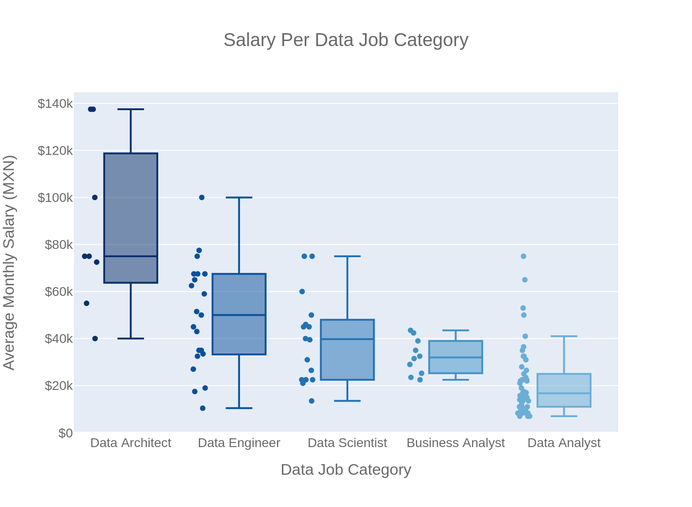

	

# Data Jobs Salaries in Mexico in February 2023
#### By Daniel Eduardo López

**28/02/2023**

**[LinkedIn](https://www.linkedin.com/in/daniel-eduardo-lopez)**

**[Github](https://github.com/DanielEduardoLopez)**

____
### **1. Introduction**
With the emergence of the big data, new jobs have appeared demanding new sets of skills and expertise for extracting value from data (Axis Talent, 2020):

- Business Analysts (BA)
- Data Analysts (DA)
- Data Architects (DR) 
- Data Engineers (DE) 
- Data Scientists (DS)

Which one is the most valued in the Mexican labor market currently?

____
### **2. General Objective**
To identify which data job category has the highest salary in the Mexican labor market in February 2023 according to the OCC website.
____
### **3. Research Question**
Which data job category has the highest salary in the Mexican labor market in February 2023 according to the OCC website?
____
### **4. Hypothesis**
The **Data Scientist** position has the highest salary in the Mexican labor market in February 2023 according to the OCC website.
____
### **5. Abridged Methodology**
The methodology of the present study is based on Rollin’s Foundational Methodology for Data Science (Rollins, 2015).

1) **Analytical approach**: Descriptive and inferential statistics.
2) **Data requirements**: Data about job positions such as job name, salary, employer and location.
3) **Data collection**: Data was collected from the OCC Website (Mexico) on 07 February 2022, through web scraping with Python 3 and its libraries Selenium and BeautifulSoup.
4) **Data exploration and preparation**: Data then was explored and cleaned with Python 3 and its libraries Pandas and Numpy. 
5) **Data analysis**: Data was analyzed with Python 3 and its libraries Pandas, Scipy and Statsmodels and visualized with Matplotlib, Seaborn, Folium and Plotly. 
6) **Statistical analysis**: The D'Agostino-Pearson normality test was used to assess the normality of the data jobs salary distribution. Then, both parametric (ANOVA and t-test with unequal variance) and non-parametric (Mann-Whitney U and Kruskal-Wallis H) tests were carried out to assess the significance of the obtained results.

Furthermore:

7) A **dashboard** was built with Python 3 and its libraries Plotly and Dash.
8) A <a href="https://github.com/DanielEduardoLopez/DataJobsMX2023/blob/main/Report.pdf"><b>final report</b></a> was written with the complete results obtained from the data.
9) Some <a href="https://github.com/DanielEduardoLopez/DataJobsMX2023/blob/main/Slides.pdf"><b>slides</b></a> were prepared with the **most important insights** from the report.

___
### **6. Main Results**
From the sample of 258 data jobs retrieved, the most demanded data job category was **Data Analyst**, with 35.3% of the total demand of data jobs in Mexico at the time of this study. On the contrary, **Business Analyst** positions are the less demanded, with only a 10.9% out of the total.

	

On the other hand, the data jobs demand is highly concentrated in Mexico City (“**Ciudad de México**”, in Spanish) with about the 56% of the total national demand of data jobs. Then, **Nuevo León** represented a distant second place with about the 11.6% of the demand. Finally, Estado de México and Jalisco accounted for about the 8.9% and 5.4% of the demand, respectively; whereas the rest of the country is lagging in terms of data jobs creation. 

	

**Data Analyst** position is the one most demanded across the Mexican states along with **Data Engineer** and **Data Scientist** positions, whereas **Data Architect** positions are highly concentrated in Ciudad de México, Nuevo León and Jalisco.

	

**Manpower** is nowadays the biggest seeker of data skills in the Mexican labor market, along with **Atento Servicios**, **Praxis** and **Softek**. 

	

Moreover, **Data Analyst**, **Data Engineer** and **Data Scientist** positions are more demanded across different organizations. On the contrary, **Data Architect** vacancies are more likely to be found in more specific organizations like tech consultancy firms (BairesDev, Everys, Praxis, Softek, etc.).

	

As expectable, most of the companies are located in **Ciudad de México** as the large majority of the vacancies are offered there. However, the following heatmap shows that there are some organizations that spread across several Mexican states such as Accenture, Praxis or Softek; and there are a few well-known companies whose data jobs demand is not located in the capital region, such as HP (Jalisco).

	

Overall, the average salary of the data jobs in Mexico in February 2023 was **35,757.79 MXN (SD = 26,219.92)** per month. 

	

A normality assumption could not be hold as the D'Agostino-Pearson normality test indicated that the null hypothesis that the sample comes from a normal distribution must be rejected at a signification level of $\alpha$ = 0.05 (*p*-value < 0.001).

Notwithstanding with the above, for the purposes of the present study, both parametric (ANOVA and t-test with unequal variance) and non-parametric (Mann-Whitney U and Kruskal-Wallis H) tests were carried out to assess the significance of the obtained results.

The salaries for each data job category are shown in the following box plot:

	

The figure above suggests that, the average and median salaries for the different data jobs categories are:

Data Job Category | Average Monthly Salary (MXN) |  Median Monthly Salary (MXN)
---|---|---
Data Architect | $86,562 |$75,000 
Data Engineer | $49,567 | $50,000 
Data Scientist | $39,687 | $39,750
Business Analyst | $32,415 | $32,000
Data Analyst | $21,240 | $16,750

A further one-way analysis of variance (ANOVA) procedure and a Kruskal-Wallis H test confirmed that the salary differences among the data jobs categories were statistically significant at a signification level of $\alpha$ = 0.05 (*p*-value < 0.001 in both tests).

Then, a series of pairwise t-tests with unequal variance (Welch's test) and Mann-Whitney U tests were performed to determine whether the average salary for different data jobs categories was significantly different, indicating that the **Data Architect's salaries are indeed significantly higher** than those for **Data Engineers** and **Data Scientists** at a signification level of $\alpha$ = 0.05 (*p*-value < 0.05). 

On the other hand, the mean salary differences between **Data Engineer-Data Scientist**, **Data Scientist-Business Analyst**, and **Data Engineer-Business Analyst** positions were not statistically significant at the same signification level; whereas the mean salary differences between **Data Scientist-Data Analyst**, **Data Engineer-Data Analyst** and **Business Analyst-Data Analyst** were statistically significant at the same signification level.

Thus, according to the results from the present statistical analysis, average salaries for Data Architects are the highest ones in the current Mexican labor market.

Furthermore, the highest salaries can be found in Ciudad de México, Nuevo León, Jalisco and Sinaloa. However, the observation for the latter state is atypical and should be interpreted with caution.

	

Moreover, the companies offering the highest salaries are **Especialistas en Talento, Zemsania México, Resources Connection México, Zegovia RH, and Reclutamiento en Tecnología**, which correspond to recruiting agencies and tech consulting firms.

	

Finally, for **Business Analyst** positions, the organizations offering higher salaries are Kelly Services and Manpower. Moreover, for **Data Analyst** positions, the organizations offering higher salaries are Especialistas en Talento and Getecsa. Furthermore, for **Data Architect** positions, the organizations offering higher salaries are Manpower and Especialistas en Talento. In addition, for **Data Engineer** positions, the organizations offering higher salaries are Manpower, Ait Vanguardia Tecnológica, and Stefanini México. And, finally, for **Data Scientist** positions, the organizations offering higher salaries are Resources Connection and Zegovia Rh.

	

Please refer to the **[Complete Report](https://github.com/DanielEduardoLopez/DataJobsMX2022/blob/main/Report.pdf)** for the full results and discussion.

___
### **7. Dashboard**
Pending...

___
### **8. Conclusions**
Pending...

___
### **9. Partial Bibliography**
- **Axis Talent. (2020).** *The Ecosystem of Data Jobs - Making sense of the Data Job Market*. Retrieved from Axis Talent: https://www.axistalent.io/blog/the-ecosystem-of-data-jobs-making-sense-of-the-data-job-market
- **Rollins, J. B. (2015).** *Metodología Fundamental para la Ciencia de Datos*. Somers: IBM Corporation. Retrieved from https://www.ibm.com/downloads/cas/WKK9DX51

___
### **10. Description of Files in Repository**
File | Description 
--- | --- 
1_DataJobsMX2023_DataCollection.ipynb | Notebook with the Python code for collecting the required data from the OCC website through web scraping.
1_DataJobsMX2023_DataCollection.html | HTML version of the Jupyter notebook.
2_DataJobsMX2023_DataAnalysis.ipynb | Notebook with the Python code for exploring, wrangling, analyzing, and visualizing the job data.
Dataset_Raw.csv | Raw data retrieved from the web scraping.
